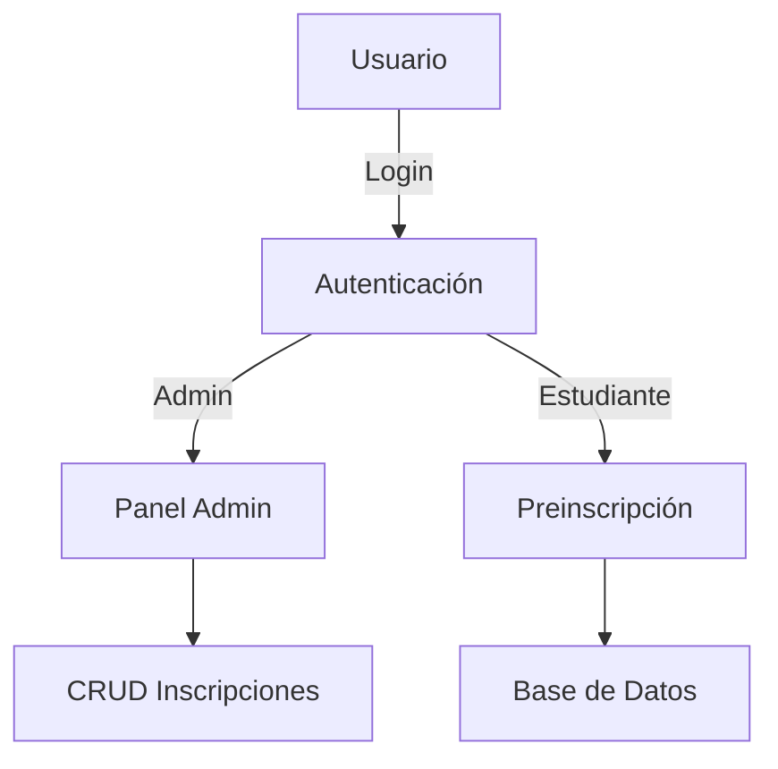

-----

# Mágnum Escuela Técnica.com - Portal de Energías Renovables

## 📝 Descripción

Mágnum Escuela Técnica es una plataforma web diseñada para gestionar programas educativos técnicos laborales en diversas áreas como administración, belleza, educación, gastronomía, idiomas, mercadeo, salud y TIC. El sistema incluye funcionalidades para:

Registro e inicio de sesión de usuarios (estudiantes y administradores)
Preinscripción a programas educativos
Gestión administrativa de inscripciones (CRUD)
Información detallada de cada escuela y sus programas
Blog educativo y sección de contacto

-----

## 🌟 Características Principales

## 👨‍🎓 Para Estudiante
* **Registro con validación de email**
* **Preinscripción en línea con persistencia de datos**
* **Visualización detallada de 50+ programas técnicos**
* **Blog con artículos educativos**

## 👨‍💼 Para Administradores
* **Panel de control con métricas**
* **Gestión completa de inscripciones (CRUD)**
* **Exportación manual de datos**
* **Modificación segura de contraseñas**

## 🖥 Sistema
* **✅ Diseño responsive (mobile-first)**
* **✅ Notificaciones por EmailJS configurable**
* **✅ Validación en frontend y backend** 
* **✅ Navegación intuitiva entre escuelas**

-----


## 🛠️ Stack Tecnológico 

| **Capa**       | **Tecnologías**                               | **Uso**                          |
|----------------|-----------------------------------------------|----------------------------------|
| **Frontend**   | HTML, CSS, JavaScript                         | Estructura y diseño              |
|                | Boxicons, Ionicons                            | Iconografía                      |
| **Backend**    | PHP                                           | Lógica de negocio                |
|                | MySQL                                         | Almacenamiento persistente       |
| **Seguridad**  | password_hash()/verify()                      | Encriptación contraseñas         |
|                | Prepared Statements                           | Prevención SQL Injection         |
| **Extras**     | EmailJS                                       | Notificaciones por correo        |


-----

## 📂 Estructura del Proyecto

```
magnum-escuela-tecnica/
│
├── admin/                          # Archivos de administración
│   ├── admin.php                   # Panel de administración principal
│
├── assets/                         # Recursos estáticos
│   ├── css/                        # Hojas de estilo
│   │   ├── style.css               # Estilos generales
│   │   ├── style1.css              # Estilos para login
│   │   ├── style2.css              # Estilos para página principal
│   │   ├── style4.css              # Estilos para contactos
│   │   └── style5.css              # Estilos para escuelas
│   │
│   ├── img/                        # Imágenes
│   │   ├── principal/              # Imágenes generales
│   │   ├── escuelas/               # Imágenes de las escuelas
│   │   ├── escuela-de-administracion/
│   │   ├── escuela-de-belleza-integral/
│   │   ├── escuela-de-educacion/
│   │   ├── escuela-de-gastronomia/
│   │   ├── escuela-de-idiomas/
│   │   ├── escuela-de-mercadeo/
│   │   ├── escuela-de-salud/
│   │   └── escuela-de-tic/
│   │
│   └── js/                         # JavaScript
│       ├── script.js               # Scripts generales
│       ├── script1.js              # Scripts para login
│       ├── script2.js              # Scripts para página principal
│       └── script4.js              # Scripts para contactos
│
├── database/                       # Configuración de base de datos
│   ├── db.php                      # Conexión a la base de datos
│   └── registro.sql                # Esquema de la base de datos
│
├── includes/                       # Archivos incluidos
│   ├── header.php                  # Cabecera común
│   └── footer.php                  # Pie de página común
│
├── index/                          # Páginas principales
│   ├── Pag_prin.html               # Página principal
│   ├── blog.html                   # Blog
│   ├── contactanos.html            # Contacto y términos
│   ├── Login.html                  # Página de login
│   ├── inscripción.html            # Formulario de inscripción
│   │
│   ├── escuelas/                   # Páginas de cada escuela
│   │   ├── EscuelaAdministracion.html
│   │   ├── EscuelaBellezaIntegral.html
│   │   ├── EscuelaEducacion.html
│   │   ├── EscuelaGastronomia.html
│   │   ├── EscuelaIdiomas.html
│   │   ├── EscuelaMercadeo.html
│   │   ├── EscuelaSalud.html
│   │   └── EscuelaTIC.html
│
├── php/                            # Lógica del servidor
│   ├── Login.php                   # Procesamiento de login
│   ├── inscripción.php             # Procesamiento de inscripciones
│   ├── procesar_contacto.php       # Procesamiento de formulario de contacto
│   └── cambio_contraseña.php       # Procesamiento de cambio de contraseña
│
├── .htaccess                       # Configuración del servidor
├── README.md                       # Documentación del proyecto
└── index.php                       # Punto de entrada principal
```

-----

## ⚙️ Instalación 

### Requisitos Mínimos
* **Servidor Apache/NGINX** 
* **PHP 7.0+ con extensión MySQL** 
* **MySQL 5.7+**
* **500MB espacio en disco**  


### Guía Paso a Paso

1.  **Clonar repositorio**  

   ```bash
  https://github.com/20-ang-t/Proyecto-Escuela-t-cnica.git
   ```

2. **Configurar base de datos**  
   ```bash
   mysql -u root -p < database/schema.sql
   ```

3. **Ajustar credenciales**  
   Editar `config/db.php`:  
   ```php
   define('DB_HOST', 'localhost');
   define('DB_USER', 'tu_usuario');
   define('DB_PASS', 'tu_contraseña');
   define('DB_NAME', 'registro');
   ```

4. **Configurar EmailJS (opcional)**  
   En `inscripción.html`:  
   ```javascript
   emailjs.init("tu-public-key");
   ```

5. **Permisos de escritura**  
   ```bash
   chmod -R 755 storage/
   ```

-----

## 📋 Manual de Usuario


### Flujo de Estudiante

1. Registrarse en `/Login.html` 

2. Explorar programas en:  
   - `/EscuelaAdministracion.html`  
   - `/EscuelaTIC.html`  
   - [etc...]  

3. Completar formulario en `/inscripción.html`  


### Panel Administrativo
 
| **Función**           | **Ruta**             | **Método**       |
|-----------------------|----------------------|------------------|
| Listar inscripciones  | `/admin.php`         | GET              |
| Crear registro        | `/admin.php`         | POST             |
| Editar registro       | `/admin.php?edit=ID` | POST             |
| Eliminar registro     | `/admin.php`         | POST (delete_id) |


* **Credenciales predeterminadas**:  
🔑 Usuario: `admin`  
🔑 Contraseña: `Adm¡n$5`  **(Cambiar en producción!)** 

-----


## 🔐 Arquitectura y Seguridad


### Diagrama de Flujo  


### Medidas de Seguridad

* **Contraseñas**: Hash bcrypt con `password_hash()`  
* **Formularios**:  
  - Validación con JavaScript + PHP  
  - Protección CSRF (en desarrollo)  
* **Base de datos**:  
  - Prepared Statements en todas las consultas  
  - Escapado de datos con `real_escape_string()`  


### Checklist de Hardening  

- [ ] Implementar HTTPS  
- [ ] Añadir CAPTCHA en login  
- [ ] Limitar intentos fallidos  
- [ ] Backup automático de BD  

-----

## 🛠️ Mejoras Futuras en la Experiencia de Usuario (UX/UI)

  * Diseño más moderno con animaciones CSS y transiciones fluidas. 
  * Modo oscuro/claro para mejor accesibilidad visual.
  * Optimización móvil con enfoque en mobile-first.
  * Mejor navegación con breadcrumbs y búsqueda predictiva.
  * Implementar un sistema de búsqueda en el sitio.
  * Añadir más contenido interactivo y animaciones.        

-----

## 🤝 Contribuciones

¡Las contribuciones son bienvenidas\! Si deseas mejorar el proyecto, por favor lee las directrices de contribución antes de enviar tus cambios.

-----

## 📄 Licencia

Este proyecto está bajo la Licencia **MIT**. Para más detalles, consulta el archivo `LICENSE` en el repositorio.

-----

## 📧 Contacto

Si tienes alguna pregunta o sugerencia, no dudes en abrir un **issue** en este repositorio.

-----

> **Nota importante**: Este proyecto es de naturaleza académica. Se recomienda realizar auditorías de seguridad antes de implementar en producción.  

